## IMPLEMENTING A WEB SOLUTION FOR A DEVOPS TEAM USING LAMP STACK WITH REMOTE DATABASE AND NFS SERVER. ##

In [Web Solution with Wordpress](https://github.com/dybran/Project-6/blob/main/project-6.md), i implemented a full fledged WordPress based solution. To make it better, i will add some more value to our solutions that a DevOps team could utilize.

I will introduce a set of DevOps tools that will help a team in day to day activities in managing, developing, testing, deploying and monitoring different projects. These tools are well known and widely used by multiple DevOps teams, so i will introduce a single DevOps Tooling Solution that will consist of:

- [__Jenkins__](https://www.jenkins.io/)

- [__Kubernetes__](https://kubernetes.io/)

- [__Jfrog Artifactory__](https://jfrog.com/artifactory/)

- [__Rancher__](https://www.rancher.com/)

- [__Grafana__](https://newrelic.com/lp/grafana-monitoring?utm_medium=cpc&utm_source=google&utm_campaign=EVER-GREEN_NB_SEARCH_GRAFANA_EMEA_UKIISA_EN&utm_network=g&utm_keyword=grafana&utm_device=c&_bt=591873806539&_bm=e&_bn=g&gclid=CjwKCAiAoL6eBhA3EiwAXDom5n1F3ISFQ0acFYLxNIw180AxlB_UV_2HpaT7k0fVntfDGagjWVIKaRoCVq0QAvD_BwE)

- [__Prometheus__](https://prometheus.io/)

- [__Kibana__](https://www.elastic.co/kibana/)

As a member of a DevOps team, you will implement a tooling website solution which makes access to DevOps tools within the corporate infrastructure easily accessible.

In this project i will implement a solution that consists of following components:

- 3 Webservers
- Database Server: MySQL
- Storage Server: NFS Server


## __3-tier Web Application Architecture with a single Database and an NFS Server__ ##


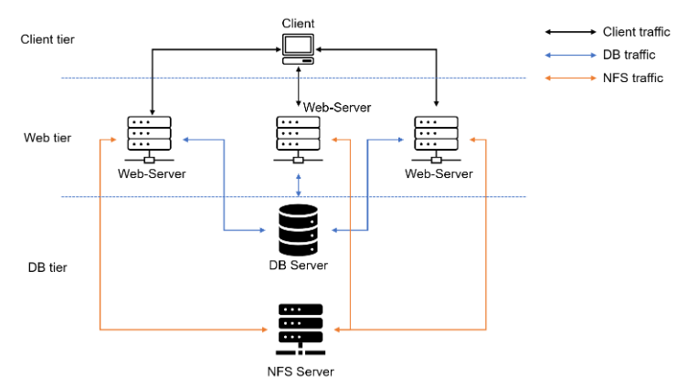

In the diagram above, there is a common pattern where several stateless Web Servers share a common database and also access the same files using Network File Sytem (NFS) as a shared file storage. Even though the NFS server might be located on a completely separate hardware – for Web Servers it look like a local file system from where they can serve the same files.

__PREPARE NFS SERVER__

I will create three logical volumes
- lv-opt
- lv-apps
- lv-logs

Check [Web Solution with Wordpress](https://github.com/dybran/Project-6/blob/main/project-6.md) on how we configure __LVM__ on the Server.

Instead of formating the disks as __"ext4"__ i will format them as __"xfs".__

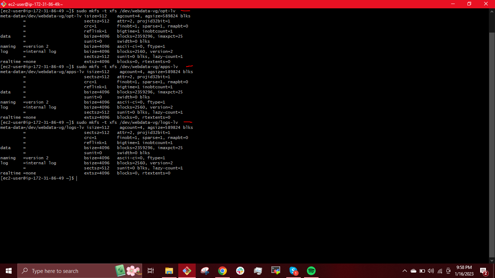

I will create mount points on __/mnt__ directory for the logical volumes as follow:

- Mount lv-apps on /mnt/apps
- Mount lv-logs on /mnt/logs
- Mount lv-opt on /mnt/opt

Reload the daemon

```$ sudo systemctl restart daemon-reload```

Verify setup by running the command:

 ```$ df -h```

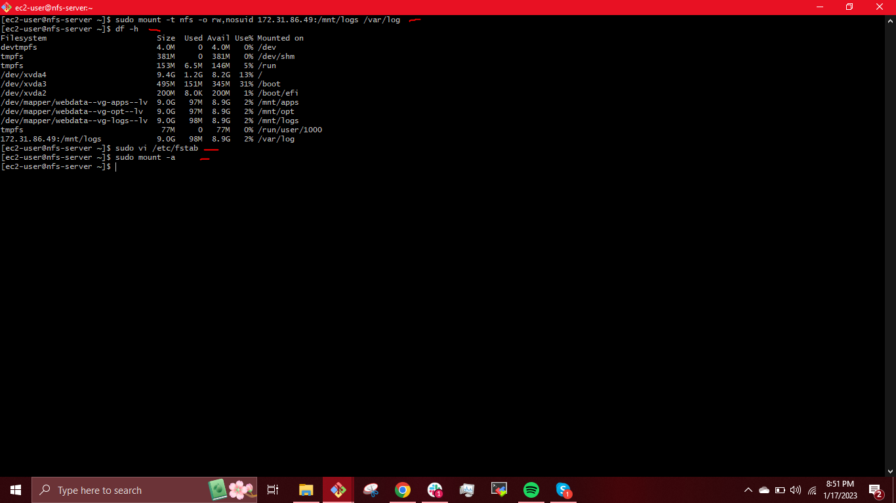

Install NFS server

```$ sudo yum -y update```

```$ sudo yum install nfs-utils -y```

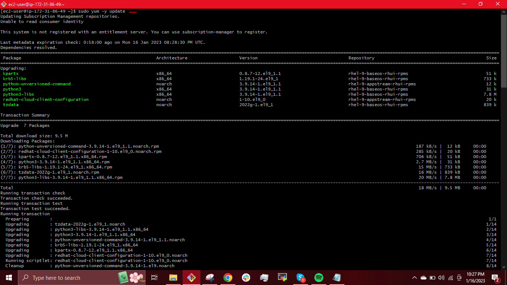
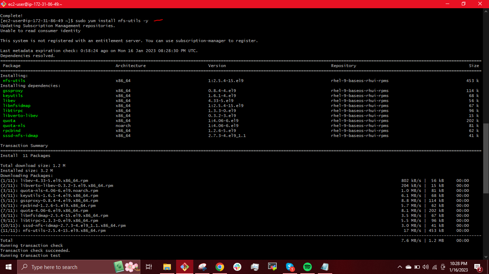


Start and verify that NFS server is up and running

```$ sudo systemctl start nfs-server```

```$ sudo systemctl enable nfs-server```

``` sudo systemctl status nfs-server```

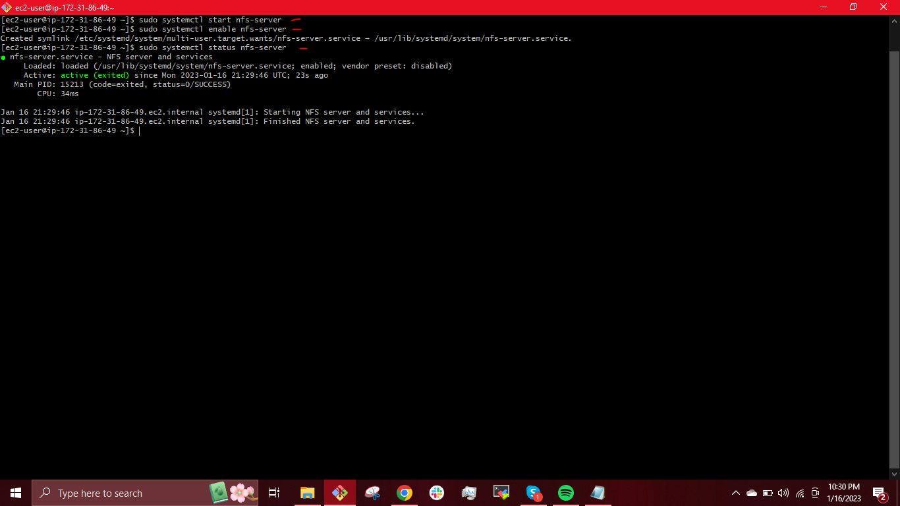


We set up permission that will allow our Web servers to access files on NFS.

Change ownership

```$ sudo chown -R nobody: /mnt/apps```

```$ sudo chown -R nobody: /mnt/logs```

```$ sudo chown -R nobody: /mnt/opt```

Change permission

```$ sudo chmod -R 777 /mnt/apps```

```$ sudo chmod -R 777 /mnt/logs```

```$ sudo chmod -R 777 /mnt/opt```

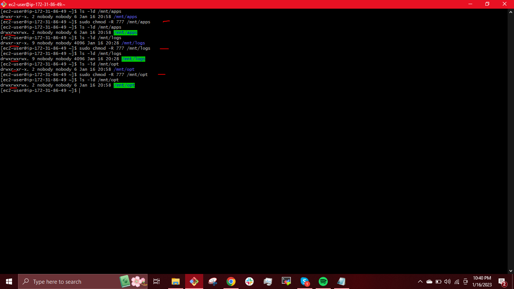

Restart the NFS server

```sudo systemctl restart nfs-server```

All three Web Servers will be installed inside the same subnet.

To check the __subnet cidr__ – open your EC2 details in AWS web console click on __"Networking"__. then __"subnet ID".__

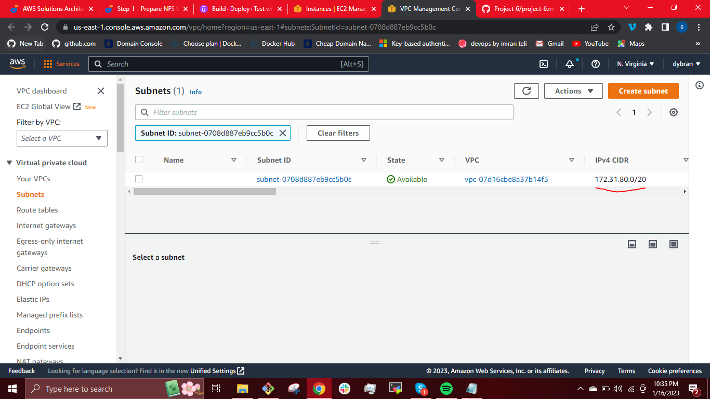

Configure access to NFS for clients within the same subnet

```$ sudo vi /etc/exports```

then edit file by adding
```
/mnt/apps <Subnet-CIDR>(rw,sync,no_all_squash,no_root_squash)
/mnt/logs <Subnet-CIDR>(rw,sync,no_all_squash,no_root_squash)
/mnt/opt <Subnet-CIDR>(rw,sync,no_all_squash,no_root_squash)
```
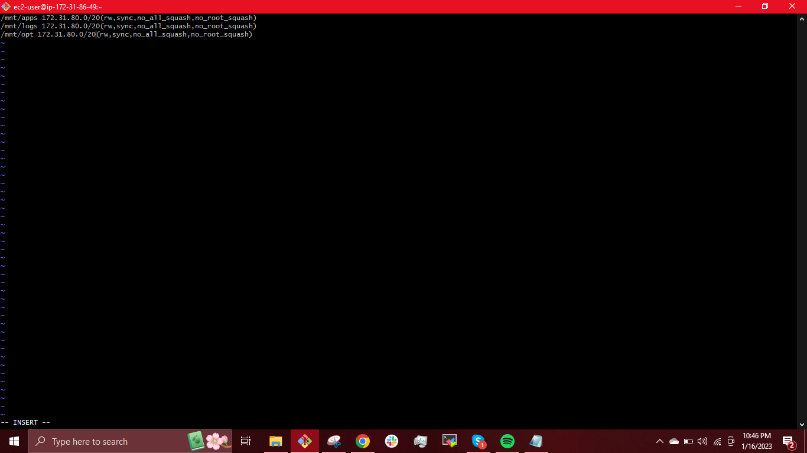

__"Esc then :wq! + Enter"__

then

```$ sudo exportfs -arv```

Check which port is used by NFS and open it in the Security Group.

```rpcinfo -p | grep nfs```


In order for NFS server to be accessible from your client, we will also open ports: __TCP 111, UDP 111 and UDP 2049.__

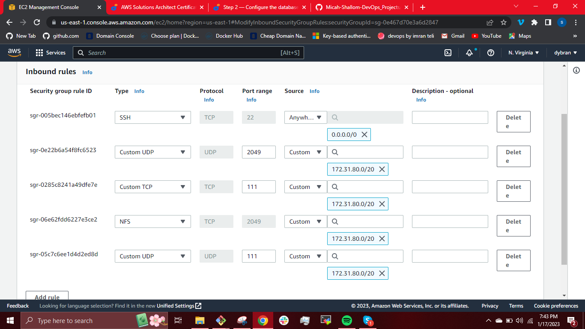

__CONFIGURE THE DATABASE SERVER__

Install mysql server

```sudo yum install mysqld -y```

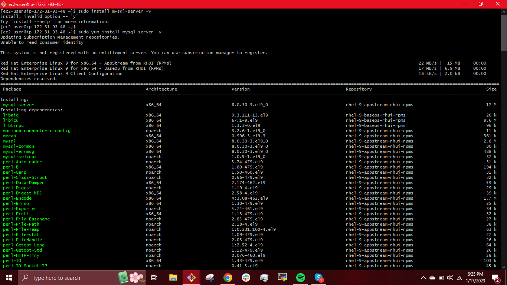

Start Mysql and verify that it is up and running

```$ sudo systemctl start mysqld```

```$ sudo systemctl enable mysqld```

```$ sudo systemctl status mysqld```

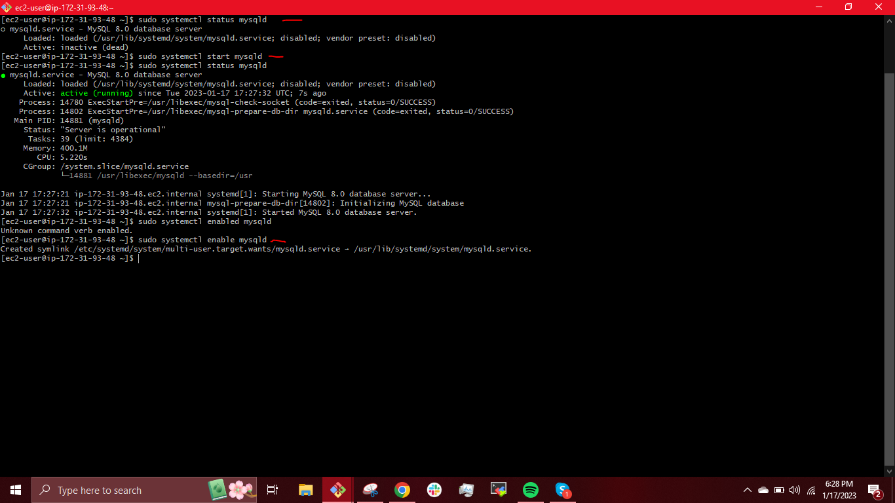

We create a database and name it __tooling.__
- Create a database user and name it __webaccess.__

- Grant permission to webaccess user on __tooling__ database to do anything only from the webservers __subnet cidr__.

```$ sudo mysql```

```Mysql> ALTER USER 'root'@'localhost' IDENTIFIED WITH mysql_native_password BY 'PassWord.1';```

```Mysql> exit;```

```$ sudo mysql_secure_installation```

Follow the prompt and create a password,

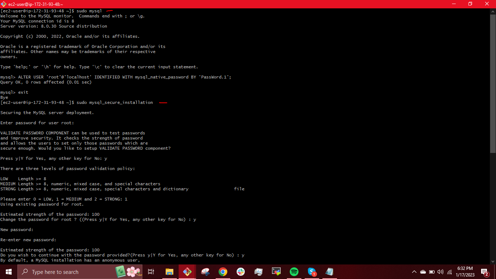

then

```$ sudo mysql -p```

```Mysql> CREATE DATABASE `example_database`;```

```Mysql> CREATE USER 'example_user'@'%' IDENTIFIED WITH mysql_native_password BY 'password';```

```Mysql> GRANT ALL ON example_database.* TO 'example_user'@'%';```

```Mysql> exit```

```$ mysql -u example_user -p```

```Mysql> SHOW DATABASES;```

We replace the following -

__example_database__ with __tooling__

__example_user__ with __webaccess__
and 

__%__ with __subnet cidr__

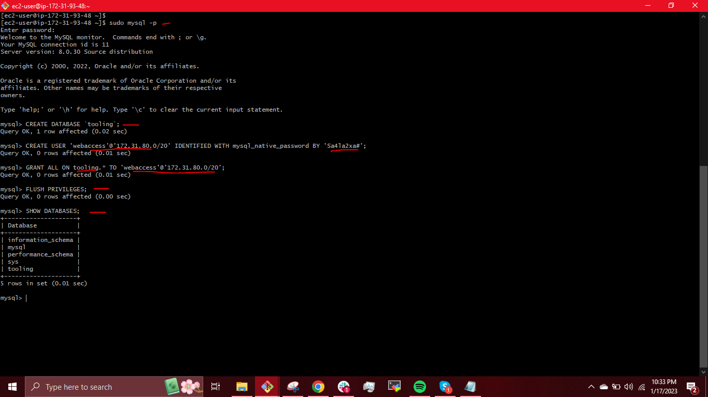

__PREPARE THE WEB SERVERS__

Our Web Servers should serve the same content from shared storage solutions – NFS Server and MySQL database.
We already know that one DB can be accessed for reads and writes by multiple clients. For storing shared files that our Web Servers will use – we will utilize NFS and mount previously created Logical Volume lv-apps to the directory where Apache stores files to be served to the users i,e __/var/www__.

This approach will make our Web Servers __stateless__, which means we will be able to add new ones or remove them whenever we need, and the integrity of the data (in the database and on NFS) will be preserved.

To achieve this, we need take do the following steps:

- Configure NFS client (this step must be done on all three servers).
  
- Deploy a Tooling application to our Web Servers into a shared NFS folder.

- Configure the Web Servers to work with a single MySQL database.

We will be using three webservers to demonstrate this.

Launch three instances
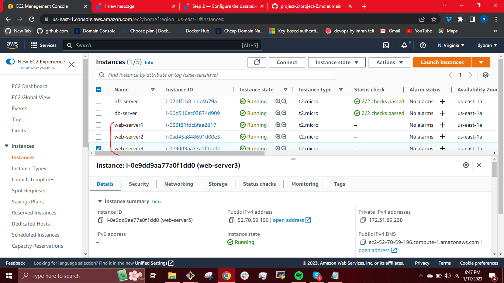

Install NFS Client

```$ sudo yum install nfs-utils nfs4-acl-tools -y```

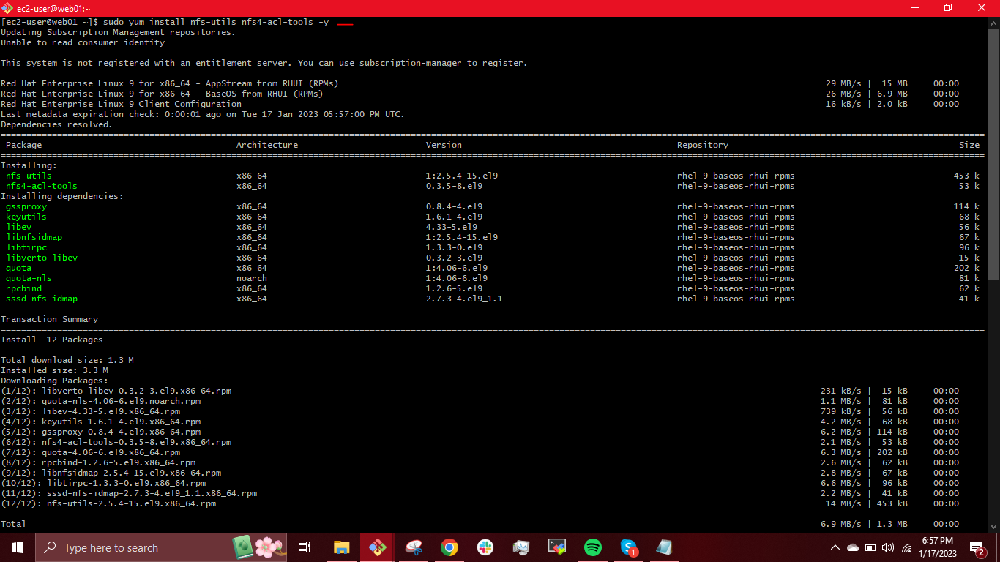

Install __Mysql__ client to be able to access the database

```$ sudo yum install mysql```

Mount /var/www/ and target the NFS server’s export for apps.

Create directory

```$ sudo mkdir /var/www```

```$ sudo mount -t nfs -o rw,nosuid <NFS-Server-Private-IP-Address>:/mnt/apps /var/www```

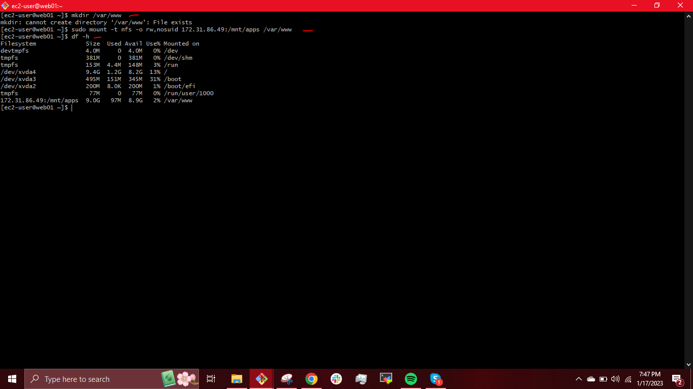

Verify that NFS was mounted successfully by running 

```$ df -h```. 

To make sure that the changes will persist on Web Server after reboot, we add it to the __/etc/fstab__ file.

```$ sudo vi /etc/fstab```

then add the following

```<NFS-Server-Private-IP-Address>:/mnt/apps /var/www nfs defaults 0 0```

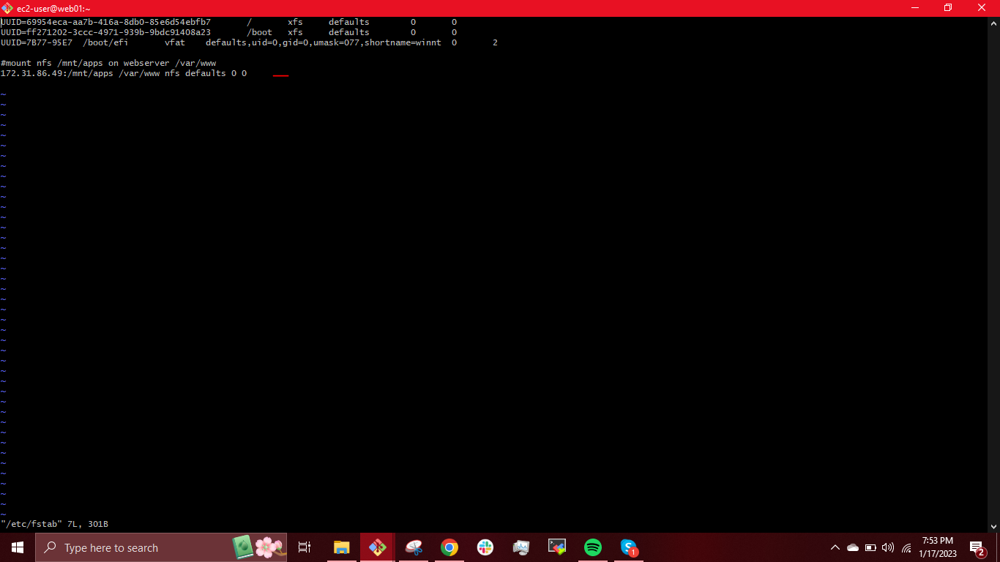

Install [Remi’s repository](https://www.subhosting.net/kb/how-to-enable-remi-repo-on-centos/), Apache and PHP


```$ sudo yum install httpd -y```

```$ sudo dnf install https://dl.fedoraproject.org/pub/epel/epel-release-latest-8.noarch.rpm```

```$ sudo dnf install dnf-utils http://rpms.remirepo.net/enterprise/remi-release-8.rpm```

```$ sudo dnf module reset php```

```$ sudo dnf module enable php:remi-7.4```

```$ sudo dnf install php php-opcache php-gd php-curl php-mysqlnd```

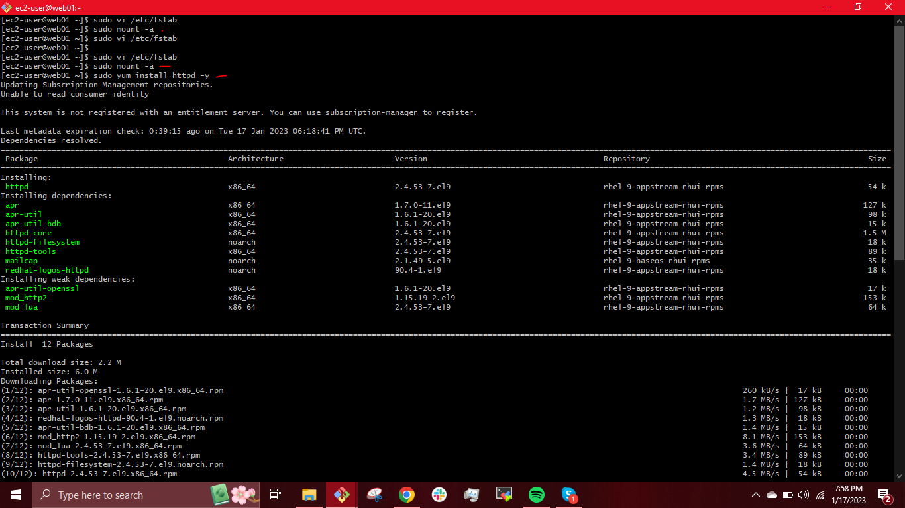
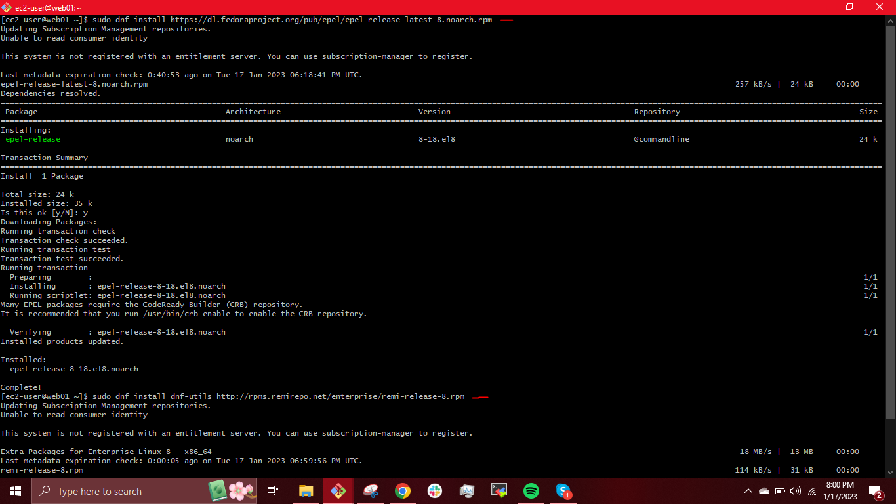
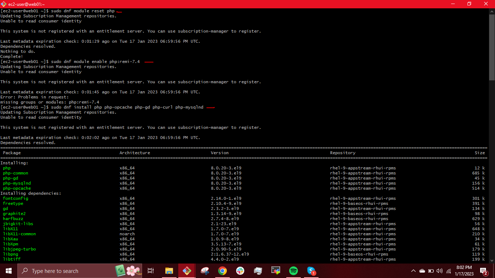

Start and enable PHP

```$ sudo systemctl start php-fpm```

```$ sudo systemctl enable php-fpm```

```$ sudo systemctl status php-fpm```

Set selinux policies

```$ sudo setsebool -P httpd_execmem 1```

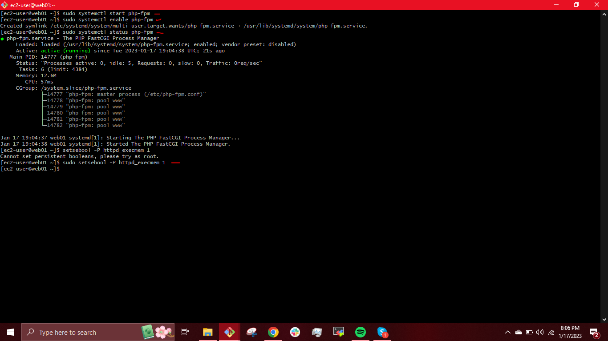

Repeat the process for the other __"2 Webservers"__.

Verify that Apache files and directories are available on the Web Server in __/var/www__ and also on the NFS server in __/mnt/apps.__ If we can see the same files, it means NFS is mounted correctly.

 To test this, we will try to create a new file touch __test.txt__ from one server and check if the same file is accessible from other Web Servers.

File created on __Web02__

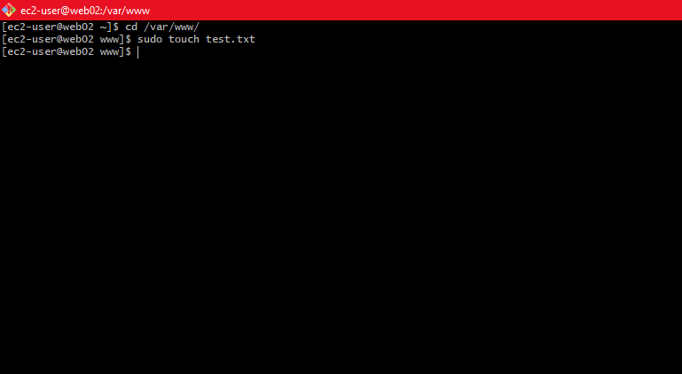

File seen from __Web01__

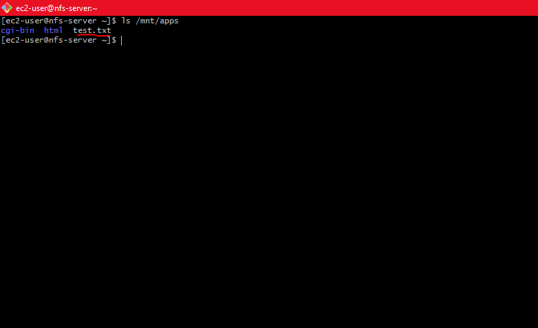

Locate the log folder for Apache on the Web Server and mount it to NFS server’s export for logs. 

```$ sudo mount -t nfs -o rw,nosuid <NFS-Server-Private-IP-Address>:/mnt/logs /var/httpd/log```

To make sure that the changes will persist on Web Server after reboot, we add it to the __/etc/fstab__ file.

```$ sudo vi /etc/fstab```

Then add the following

```<NFS-Server-Private-IP-Address>:/mnt/logs /var/httpd/log nfs defaults 0 0```

Fork the tooling source code from [My Github Account](https://github.com/dybran/tooling) to your Github account. 

Learn how to fork a repo [here](https://www.youtube.com/watch?v=f5grYMXbAV0).

We will deploy the tooling website’s code to the Webserver. We will be deploying the __html__ folder from the repository to __/var/www/html__.

First we create a folder in the home directory,

```$ mkdir tooling-repo```

Then ```cd``` into the directory.

Install __git__

```$ sudo yum install git -y```


Initiate __git__

```$ git init```

Copy the url from [My Github Account](https://github.com/dybran/tooling)

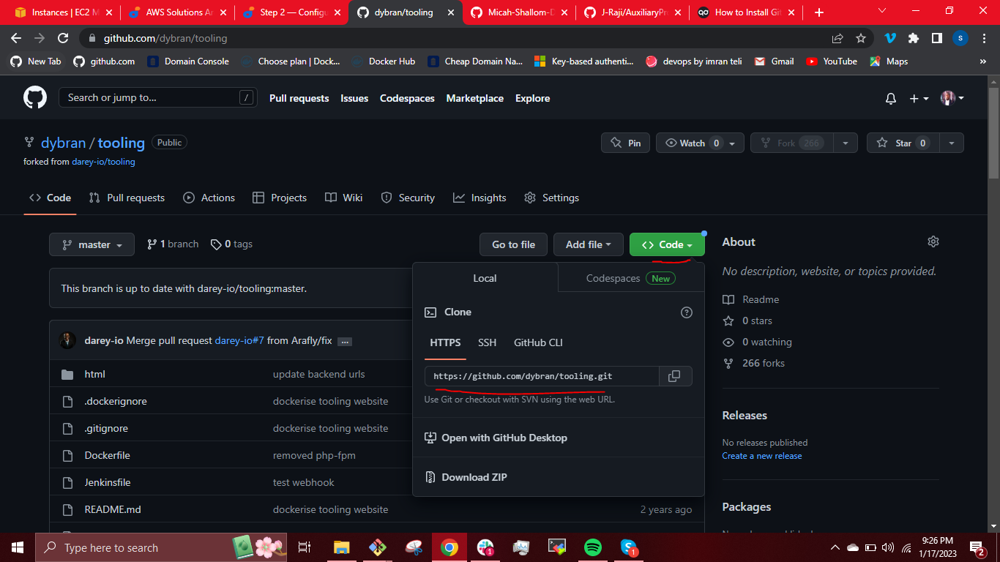

Inside the __tooling-repo directory__, we copy the content of the repository into the directory by running the command:

```$ git clone <github-url>```

__"github-url"__ is the __url__ we copied from github.

Deploy the __html__ directory to the __/var/www/html__ directory.

```$ sudo cp -R tooling-repo/tooling/html /var/www/html```

Restart the Apache

```$ sudo systemctl restart httpd```

Open __port 80__ on webservers to be able to connect to the browser.

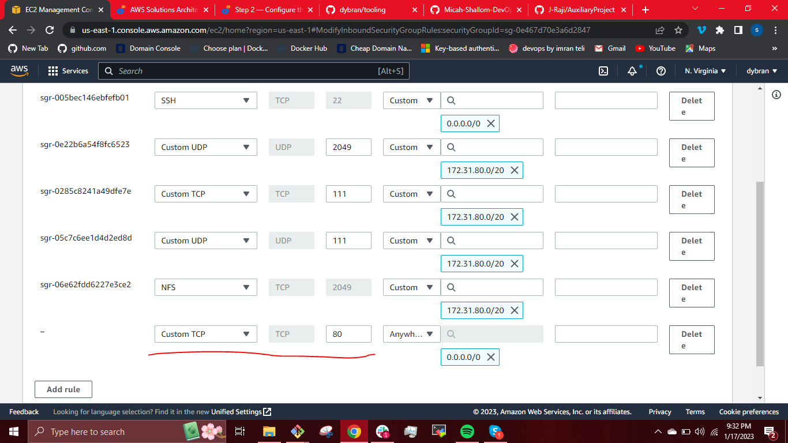

Open __port 3306__ on both __database server__ and __web servers__.

set selinux policy:
  
```$ sudo setenforce 0```

To make this change permanent – open following config file

```$ sudo vi /etc/sysconfig/selinux``` 

Set ```SELINUX=disabled``` 


then restart httpd.

```$ sudo systemctl restart httpd```

Update the website’s configuration to connect to the database in __/var/www/html/functions.php__.

```$ sudo vi /var/www/html/functions.php```

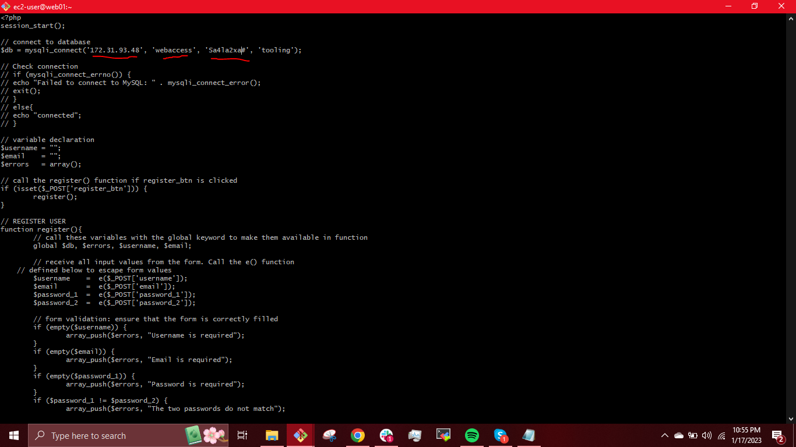

We create a new admin by applying __tooling-db.sql__ script from (__tooling-repo directory__) to your database using the command:

```$ mysql -h <databse-private-ip> -u <db-username> -p <database> < tooling-db.sql```

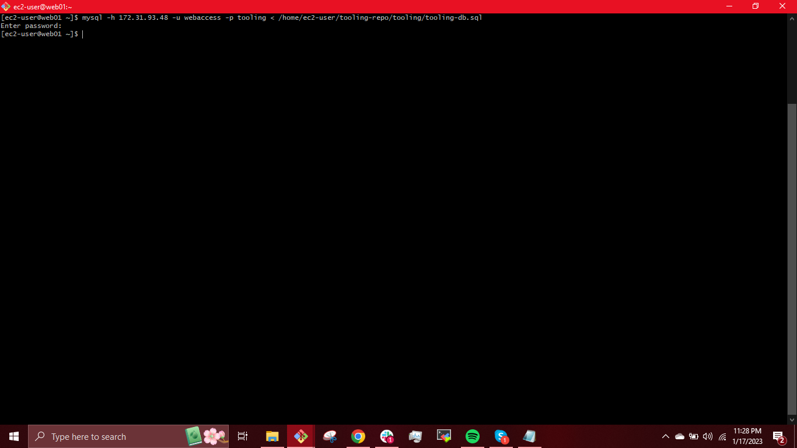

To check for the created admin in the database we run the commands

```$ sudo mysql -p```

```mysql> use tooling;```

```mysql> show tables;```

```mysql> select from * users;```


Open the website in your browser

```http://<Web-Server-Public-IP-Address-or-Public-DNS-Name>/index.php```

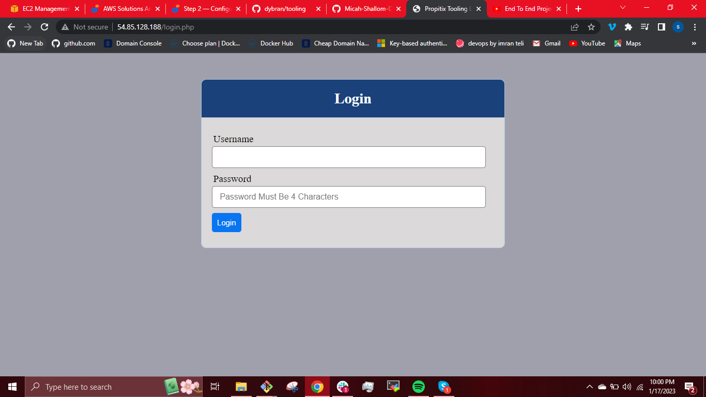

We should be able to loging using our username amd password as both __admin__.
If we are unable to log in, we should check our connection to the database.

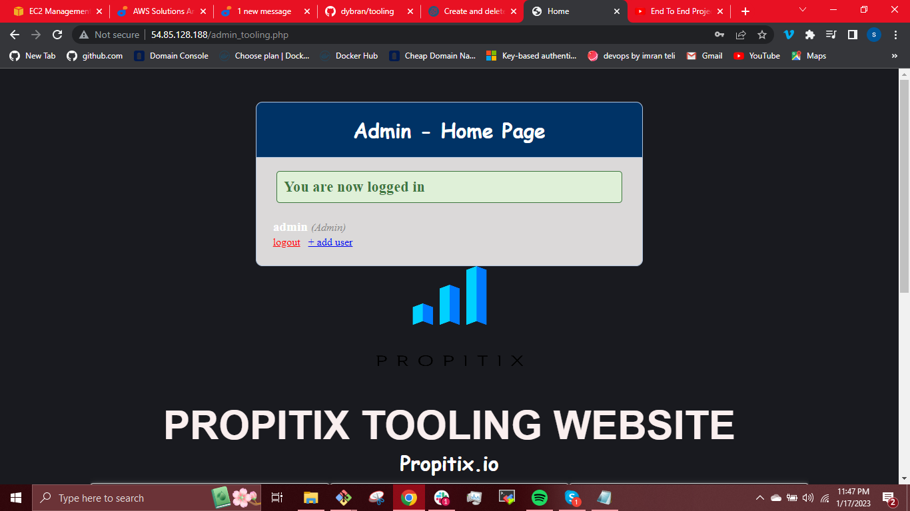

We have just implemented a __web solution for a DevOps team using LAMP stack with remote Database and NFS servers.__


